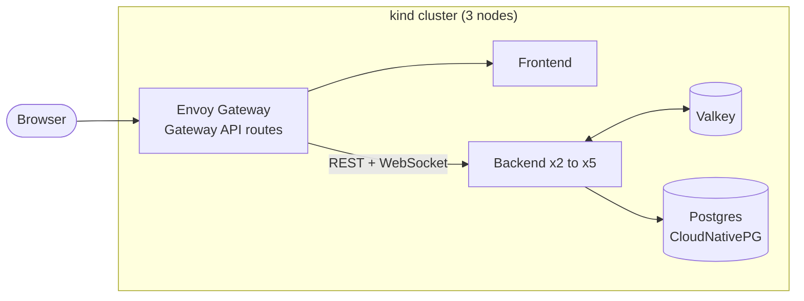

# Mathboard

A collaborative LaTeX editor that renders as you type. Write math like it's a document.

**Live:** https://mathboardx.vercel.app

[](https://github.com/AZazwinner/Mathboard/actions/workflows/ci.yml)

## Features

- Real-time collaborative editing
- LaTeX rendered live, inline and block
- Document sharing with read/write permissions
- Version history

## Stack

- Frontend: Next.js ([app/](app))
- Backend: FastAPI, Yjs (via pycrdt) for conflict-free editing ([src/](src))
- Database: PostgreSQL (SQLite still works for quick local runs)

## Also a Kubernetes project

The app above runs in production as a single process. The rest of this repository is what it took to run it
properly on Kubernetes: several backend replicas that keep every user's edits in sync, then the testing,
monitoring, autoscaling, delivery pipeline and backups that make that trustworthy. Everything is free to run and
lives in [deploy/](deploy).



Monitoring, autoscaling, GitOps and backups are optional layers on top. The full picture, the path an edit
takes between replicas, and the delivery pipeline are in [docs/architecture.md](docs/architecture.md).

| Concern | What was built | Evidence |
|---|---|---|
| **Correct with many replicas** | Users on different replicas see each other's edits: per-document Valkey streams, and saves that merge into Postgres instead of overwriting. | [ADR 1](docs/adr/0001-multi-replica-document-sync.md); a chaos suite of 5 failure scenarios passes (below) |
| **Load tested, and fixed** | k6 simulates up to 800 users. The first runs failed; the findings (connection exhaustion, slow saves, probes killing busy pods) are fixed and documented. | [deploy/tests](deploy/tests/README.md) |
| **Observable** | Prometheus metrics on a private port, a Grafana dashboard, five alert rules. | [ADR 3](docs/adr/0003-metrics-and-connection-based-autoscaling.md) |
| **Autoscaled** | KEDA scales the backend on open WebSocket connections. | [ADR 3](docs/adr/0003-metrics-and-connection-based-autoscaling.md) |
| **Delivered from git** | CI on every pull request, images scanned before they are published and then signed, Argo CD deploying what is merged. | [ADR 4](docs/adr/0004-ci-supply-chain-and-gitops.md) |
| **Recoverable** | Continuous backup with point-in-time recovery, proven by a restore drill. | [ADR 5](docs/adr/0005-database-backups-and-restore-drill.md) |

All decisions, with the alternatives considered and what each costs, are indexed in
[docs/adr](docs/adr/README.md).

### Results

Measured on one laptop that also runs the load generator, so read absolute numbers as indicative
([why, and the full tables](deploy/tests/README.md)).

| | Result |
|---|---|
| **Chaos** (12 simulated users editing one document) | Passes in all 5 scenarios: no failure, a pod deleted gracefully, a pod force-killed, Valkey down for 10 s, and a rolling restart of every backend pod (2,400 edits over 65 s). Every client ends with every edit, all clients identical, Postgres has every block. |
| **Load** | 200 to 800 users at 1, 3 and 5 replicas: every connection succeeded, no socket dropped, no pod restarted. Up to 400 users, fan-out p95 is 14 ms or less. At 800 users, p95 is 458 ms on one replica and 208 ms on five. |
| **Autoscaling** | 220 users took the backend from 2 to 4 replicas in 28 s with no dropped connection and 12 ms p95, then back to 2 about five minutes after they left. |
| **Restore** | A second database restored to a chosen moment in 51 to 52 s; exactly the right rows came back and every real table matched. |
| **Supply chain** | Image scanning found 2 critical and 4 high vulnerabilities in the frontend's Next.js version; upgraded. CI also found an intermittent test failure from shared state across event loops; fixed. |

## Try it locally

You need Docker (about 4 GiB free for the base cluster, and roughly 0.5 GiB more for each optional layer),
plus `kind`, `kubectl` and `helm`, and a bash shell (Git Bash on Windows).

```
bash deploy/kind/up.sh                   # cluster, Postgres, gateway, the app: http://app.localhost:8080
bash deploy/tests/run-chaos.sh           # kill things while people are editing
bash deploy/tests/run-load.sh            # simulated users at 1, 3 and 5 replicas

bash deploy/kind/observability.sh up     # Prometheus, Grafana, KEDA autoscaling
bash deploy/kind/backups.sh up           # then: bash deploy/tests/run-restore-drill.sh
bash deploy/kind/argocd.sh up            # deploy from git
bash deploy/kind/status.sh               # what is on
```

Details and design notes are in [deploy/README.md](deploy/README.md). For the plain application (no
Kubernetes), see [SETUP.md](SETUP.md).

## Documentation

- [docs/architecture.md](docs/architecture.md): diagrams
- [docs/adr](docs/adr/README.md): decision records
- [deploy/README.md](deploy/README.md): running and operating the cluster
- [deploy/tests/README.md](deploy/tests/README.md): chaos, load, autoscaling and restore tests, and what they found

## License

[MIT](LICENSE)
