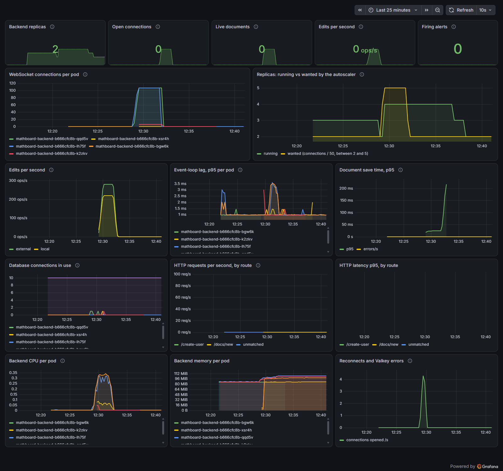

# Running Mathboard on Kubernetes (local)

A 3-node [kind](https://kind.sigs.k8s.io/) cluster (1 control plane, 2 workers) running the whole stack.

## Prerequisites

`docker`, `kind`, `kubectl` and `helm` on your PATH, and a bash shell (Git Bash on Windows).

## Use it

```
bash deploy/kind/up.sh      # create the cluster and deploy everything (safe to re-run)
bash deploy/kind/down.sh    # delete the cluster and its data
```

Then open http://app.localhost:8080. The API is at http://api.localhost:8080. Browsers resolve
`*.localhost` to your own machine on their own; command-line tools on Windows may not, so with
curl use `-H "Host: api.localhost" http://127.0.0.1:8080/...`.

## What runs

| Piece | How |
|---|---|
| Kubernetes | kind, node image pinned by digest to v1.36.4 (see below) |
| Ingress | [Envoy Gateway](https://gateway.envoyproxy.io/) v1.9.1, using the Gateway API (`Gateway` + `HTTPRoute`) |
| Database | PostgreSQL 17 via the [CloudNativePG](https://cloudnative-pg.io/) operator |
| Live sync | [Valkey](https://valkey.io/) 9.1: carries edits and cursors between backend replicas, and holds shared login rate limits |
| App | Helm chart in `helm/mathboard`: 3 backend replicas, frontend, migration Job, config, routes |
| Monitoring (optional) | Prometheus, Grafana and [KEDA](https://keda.sh/), added by `kind/observability.sh` |
| GitOps (optional) | [Argo CD](https://argo-cd.readthedocs.io/) deploys the chart from git, added by `kind/argocd.sh` |
| Backups (optional) | CloudNativePG's Barman Cloud plugin, cert-manager and a SeaweedFS S3 store, added by `kind/backups.sh` |

Traffic: `localhost:8080` -> kind node port 30080 -> Envoy -> `app.localhost` goes to the frontend,
`api.localhost` (including WebSockets) goes to the backend.

Two hostnames instead of one path prefix, because the backend and frontend both use paths like `/docs`.

## Decisions worth knowing

- **Kubernetes 1.36, not kind's default 1.37.** Envoy Gateway v1.9 supports Kubernetes 1.33 to 1.36 and
  CloudNativePG 1.30 supports 1.34 to 1.36, so 1.36 is the newest version both support. The image is
  pinned by digest in `kind/kind-config.yaml`.
- **`externalTrafficPolicy: Cluster` on the Envoy Service** (`kind/infra/gateway.yaml`). Envoy Gateway
  defaults it to `Local`, which makes a node forward NodePort traffic only to Envoy pods on that same
  node. kind maps the host port onto the control-plane node, which has no Envoy pod, so requests from
  the host hung while requests from inside the node worked.
- **Migrations are a Helm hook Job** (`pre-install`, `pre-upgrade`) that runs `alembic upgrade head`
  with only `DATABASE_URL`, so a new version's schema is in place before its pods start.
- **`DATABASE_URL` comes from the Secret CloudNativePG generates** (`mathboard-db-app`, key `uri`), so
  no database password is written down anywhere.
- **`SECRET_KEY` is generated once** by the chart and reused on upgrades (via `lookup`), unless you
  pass `--set secretKey=...`.
- **Graceful shutdown:** a 5 second `preStop` sleep lets the Service stop routing before the process
  gets SIGTERM, and a 40 second grace period leaves room for the final document flush.
- **Images are tagged by content** (`dev-<image id>`), so re-running `up.sh` only rolls pods when the
  code actually changed.
- **Frontend URLs are baked in at build time**, so `up.sh` builds the frontend with the
  `app.localhost:8080` / `api.localhost:8080` addresses.

## Several backend replicas

The backend runs 3 replicas, spread over the worker nodes, with a PodDisruptionBudget so at least one
stays up during node maintenance and a rolling update that never removes a pod before its replacement
is ready. Every open document has a live copy in each replica that has a viewer of it. The design and
the alternatives are in [docs/adr/0001-multi-replica-document-sync.md](../docs/adr/0001-multi-replica-document-sync.md).

In short: a local edit is applied, sent to that replica's own sockets, and appended to a Valkey stream.
Every other replica reads the stream and applies the same update. Periodically each replica merges its
copy into Postgres under a per-document lock, and reads back what others saved, which is also the
fallback when Valkey is unreachable.

The failure behavior is tested by a script, not by hand: `bash deploy/tests/run-chaos.sh` runs 12 simulated
browsers on one document while a failure is injected, and passes only if every client ends with every edit,
all clients hold the identical document, and Postgres holds every block. Latest run, 3 replicas:

| Injected failure | Edits | Result |
|---|---|---|
| none | 540 | converged 0.5 s after the last edit |
| busiest pod deleted gracefully (a rolling deploy) | 540 | its clients reconnected once; converged in 0.5 s; no edit lost |
| busiest pod force-killed (a crash) | 540 | same |
| Valkey scaled to zero for 10 s | 540 | no client disconnected; converged 2.7 s after the last edit |
| rolling restart of every backend pod | 2,400 over 65 s | every client reconnected once or twice; converged in 2.2 s; no edit lost |

Load behavior (how many users, how much latency, and what broke on the way) is in
[tests/README.md](tests/README.md).

## Monitoring and autoscaling (optional)

```
bash deploy/kind/observability.sh up          # install Prometheus, Grafana and KEDA, and turn autoscaling on
bash deploy/kind/observability.sh grafana     # dashboard at http://localhost:3000 (no login to view)
bash deploy/kind/observability.sh status      # what's running and what the autoscaler is doing
bash deploy/kind/observability.sh down        # autoscaling off, everything removed
```

It adds about 0.5 GiB of pod memory (Grafana about 250 MiB, Prometheus 100 to 300 MiB depending on how long
it has run, KEDA about 75 MiB), so it is off until you ask for it. The backend serves
metrics on a separate port (9100) that the gateway never routes to; Prometheus finds the pods through their
`prometheus.io/*` annotations. Grafana has one dashboard, provisioned from
`kind/observability/dashboards/mathboard.json`.

With autoscaling on, KEDA keeps the backend between 2 and 5 replicas, aiming for 50 open WebSocket
connections each, and `backend.replicas` is ignored. Scale-up is quick; scale-down waits 5 minutes and then
removes one pod a minute. `bash deploy/tests/run-autoscale.sh` shows it happening. The reasoning and the
alternatives are in [docs/adr/0003-metrics-and-connection-based-autoscaling.md](../docs/adr/0003-metrics-and-connection-based-autoscaling.md).



## GitOps with Argo CD (optional)

```
bash deploy/kind/argocd.sh up       # install Argo CD, take Mathboard over from Helm, deploy from git
bash deploy/kind/argocd.sh ui       # UI at http://localhost:8081 (prints the admin password)
bash deploy/kind/argocd.sh status
bash deploy/kind/argocd.sh down     # back to a Helm-managed Mathboard built from your working copy
```

Once it's on, the cluster follows `main`: a merged pull request builds and scans two images
([`.github/workflows/images.yml`](../.github/workflows/images.yml)), publishes them to GitHub Container
Registry, commits the new image tag into [`gitops/values-kind.yaml`](gitops/values-kind.yaml), and Argo CD
applies it. While it manages Mathboard, `up.sh` leaves the application alone. Two one-time steps: the
GHCR packages are private when first published, so make `mathboard-backend` and `mathboard-frontend` public
in their package settings; and merge to `main` at least once so there are images to deploy. To try a branch
instead: `REVISION=my-branch bash deploy/kind/argocd.sh up`. Why it's built this way:
[docs/adr/0004-ci-supply-chain-and-gitops.md](../docs/adr/0004-ci-supply-chain-and-gitops.md).

## Backups and restore (optional)

```
bash deploy/kind/backups.sh up            # cert-manager, the plugin, an object store, and backups on
bash deploy/tests/run-restore-drill.sh    # restore a second cluster to a chosen moment and check it
bash deploy/kind/backups.sh status
bash deploy/kind/backups.sh down
```

Continuous WAL archiving plus a nightly base backup allow restoring to any moment, not only to a backup.
The drill takes a backup, writes rows before and after a chosen time, restores a second cluster to that time
and fails unless exactly the right rows come back and every real table matches. Latest: passed, base backup
14 to 50 s across two runs, restore to a ready cluster 51 to 52 s ([results](tests/results/restore-drill-latest.md)). The object store
lives inside the cluster, so it shows the mechanism but does not protect against losing the machine.
See [docs/adr/0005-database-backups-and-restore-drill.md](../docs/adr/0005-database-backups-and-restore-drill.md).

## Useful commands

```
kubectl get pods -A
kubectl logs deploy/mathboard-backend
kubectl exec mathboard-db-1 -c postgres -- psql -U postgres -d mathboard
kubectl exec deploy/mathboard-valkey -- valkey-cli monitor
kubectl scale deploy/mathboard-backend --replicas=5   # not with autoscaling on: KEDA would undo it
```

Valkey deliberately has no persistence (`emptyDir`, no snapshots): it only holds short-lived
coordination state, and Postgres stays the source of truth. If it restarts, editing continues and
replicas catch up through the database.
