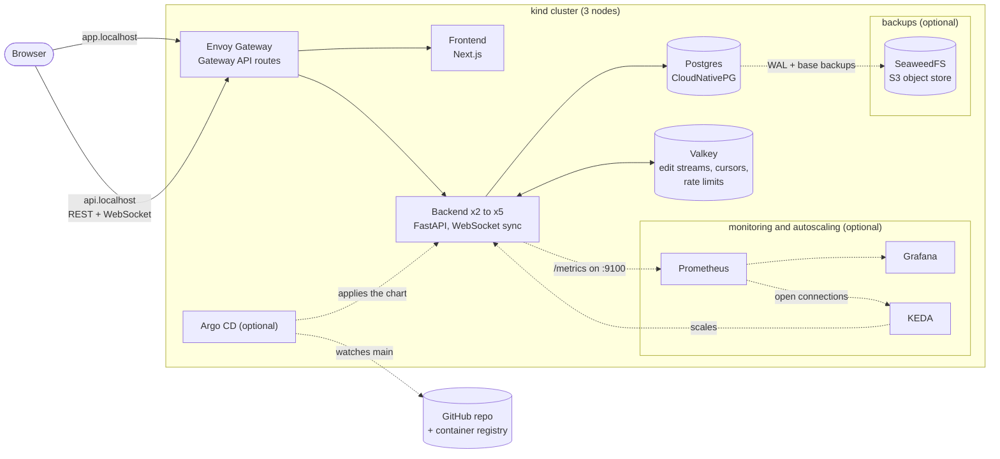
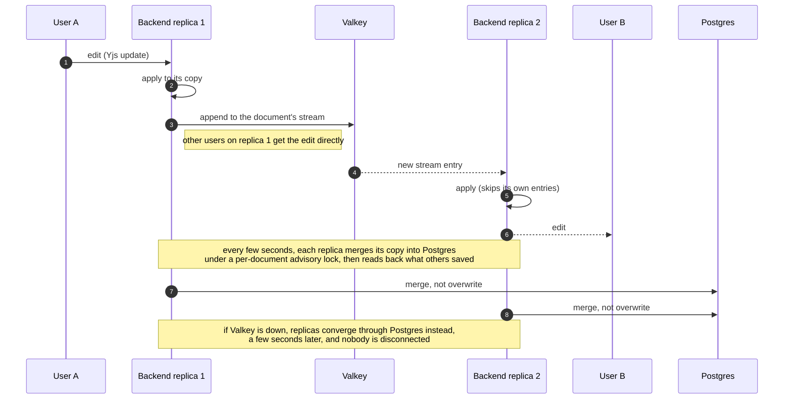
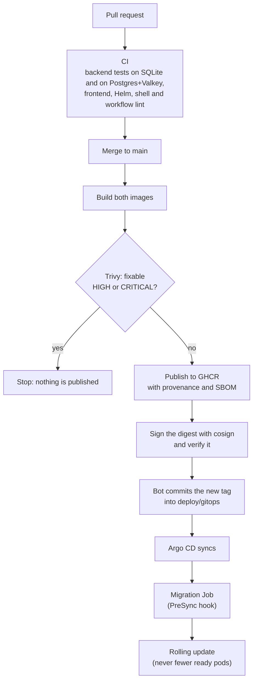

# Architecture

Three views: what runs where, how one edit travels between users on different replicas, and how a change
gets from a pull request to the running cluster. The reasoning behind each choice is in the
[decision records](adr/README.md).

## What runs where

The optional layers (dashed) are added by scripts in [`deploy/kind`](../deploy/kind) and cost extra memory.

The production deployment (Vercel for the frontend, one FastAPI process on a small server) is
unchanged; the cluster is the scalable, observable and recoverable version of the same application.

## How one edit reaches another user

Users editing the same document can be connected to different backend replicas. Each replica keeps its own
in-memory copy of the document, and Valkey carries edits between them. Because Yjs updates commute and are
idempotent, replicas converge whatever order the updates arrive in, and applying one twice is harmless
([decision 1](adr/0001-multi-replica-document-sync.md)).

## From pull request to running cluster

Pull requests run the same build and scan but publish nothing. Deploying is a git operation: to roll back,
revert the commit that bumped the tag.
